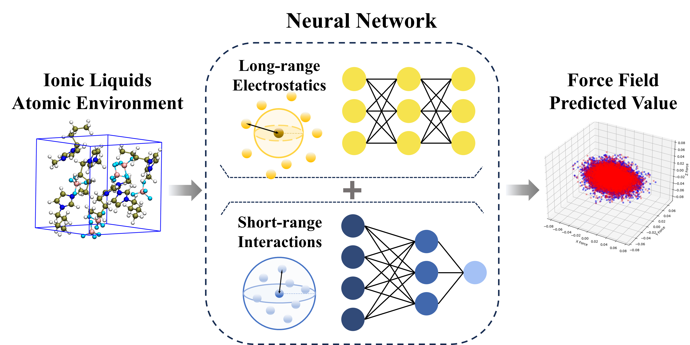

# ElecFF

Thank you for your interest in this project! The following presentations are aimed to provide you with a deeper understanding of this research.

## model.py

model.py defines the two most prominent models in the research, ElecFF and NoElec.

## param_elecff.py

param_elecff.py is the parameter training part of ElecFF.

## train_elecff.py

train_elecff.py is the predicted energy and force part of ElecFF.
